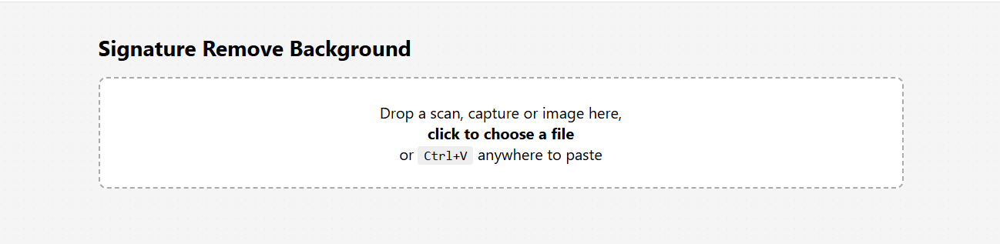
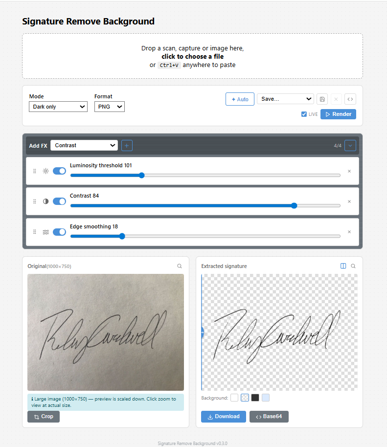
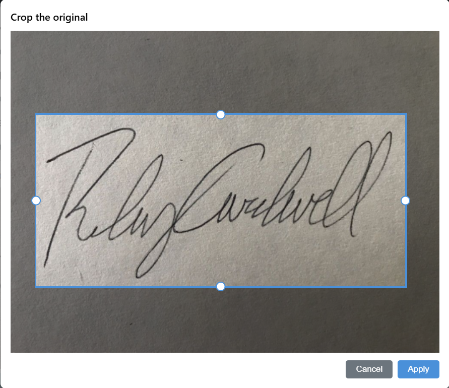
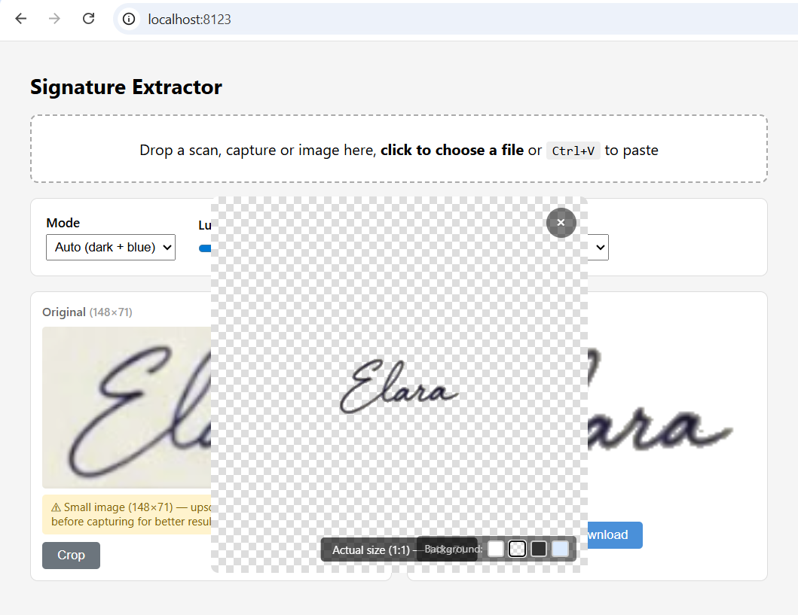

# Signature Remove Background

[](LICENSE)

Self-hosted signature background remover — ultra-lightweight alternative to heavy ML-based tools like rembg. Remove background from handwritten signatures (dark or blue ink) and export as transparent PNG or WebP. No machine learning, no cloud, no GPU: runs in Docker with ~30 MB RAM and processes images in under 100 ms. Includes a REST API and a built-in web UI.

## Comparison with ML solutions

| | ML solutions (rembg, withoutbg…) | Signature Remove BG |
|---|---|---|
| RAM idle | ~2 GB | ~30 MB |
| RAM processing | ~2.5 GB | ~50–80 MB |
| Time/image | 2–5 s | < 100 ms |
| Docker image | ~1.5 GB | ~120 MB |
| Use case | Any background | Signatures on light backgrounds |

## Prerequisites

- Docker + Docker Compose

## Installation

```bash
git clone https://github.com/fchaussin/signature-remove-bg.git
cd signature-remove-bg
docker compose up -d
```

The service is available at `http://localhost:8000` (the port is configurable via `.env`).

## Web interface

Open `http://localhost:8000` in a browser.

### Uploading an image



Three import methods:
1. **Drag & drop** a scan, capture or image onto the upload zone
2. **Click** the zone to open the file picker
3. **Ctrl+V** anywhere to paste a screenshot from the clipboard

The upload zone stays visible at the top of the page so you can load a new image at any time.

### Real-time settings



After uploading, a settings panel appears with instant preview:

| Setting | Description |
|---|---|
| Mode | `Auto` (dark + blue), `Dark only`, `Blue only` |
| Luminosity threshold | Sensitivity to dark pixels (50–250) |
| Blue tolerance | Sensitivity to blue tints (20–200) |
| Contrast | Boost ink opacity for faint scans (0–100) |
| Edge smoothing | Anti-aliasing width on signature edges (0–100) |
| Format | PNG or WebP |

Each change triggers automatic re-extraction (debounced at 300 ms) in live mode. A progress bar animates at the bottom of the controls panel during extraction.

### Render mode

Three render modes control when extraction runs:

| Mode | Behavior |
|---|---|
| **Live** | Auto re-extract on every parameter change (debounced). Best for small images |
| **Manual** | Extract only when clicking the **Render** button or pressing `Ctrl+Enter`. Recommended for large images or shared servers |
| **Auto** (default) | Starts in live mode. Automatically switches to manual when the image exceeds a pixel threshold (`AUTO_MANUAL_PIXELS`) |

A **Live** toggle in the controls bar lets the user switch between live and manual at any time. In manual mode, the extracted preview dims to indicate it's outdated, and the Render button pulses until clicked.

### Effects rack

The four effects (threshold, blue tolerance, contrast, smoothing) are displayed as a reorderable rack. Each effect has:

- A **toggle** (checkbox) to enable/disable it
- A **slider** for its value
- A **drag handle** to reorder the processing pipeline

The order in which effects are applied changes the final result. Drag & drop to experiment with different processing chains.

### Auto-detect

The **Auto** button analyzes the uploaded image and suggests optimal settings (mode, threshold, blue tolerance, smoothing, contrast). When analysis completes, the button pulses to signal readiness. Clicking it applies the detected values.

### Presets

Save your settings as named presets stored in `localStorage`:

- **Save**: save current settings under a name (pre-fills current preset name for overwrite)
- **Delete**: remove a saved preset (confirmation dialog)
- **Select**: switch between presets instantly (reloads all settings)
- **Default**: restores server defaults

When you modify settings after loading a preset, the select shows "Save…" to indicate unsaved changes. The save button becomes active and the delete button is disabled until you save or re-select the preset.

### API request helper

The **`</>`** button in the preset bar toggles a Swagger-style API block showing the current extraction request:

- Displays the live `POST /extract?…` endpoint with current parameter values
- **Copy cURL** button to copy a ready-to-use `curl` command
- **Expand** arrow to show a parameter detail table (name, value, type, range)

### Cropping



The **Crop** button (on the original panel) opens a cropping tool with 4 edge handles (top, bottom, left, right) that can be dragged inward. Excluded areas are dimmed in real time. Applying the crop updates the original image and re-triggers extraction automatically.

### Actual-size zoom



Click the original or extracted image to open a popup at actual size (1:1). If the image exceeds the viewport, move the mouse to pan.

### Signature preview

The preview area displays the extracted signature. A background color picker lets you visualize the result on different backgrounds:

- **White** (default) — simulates final use on a document
- **Checker** — shows alpha channel transparency
- **Dark** — for verifying light signatures
- **Light blue** — simulates a colored document background

### Download & Base64 export

The **Download** button saves the extracted signature in the chosen format. The **Base64** button opens a popup with:

- A **format selector** to choose the output template:

| Format | Output |
|---|---|
| Plain text | Raw base64 string |
| Data URI | `data:image/png;base64,…` |
| CSS Background Image | `background-image: url(…);` |
| HTML Favicon | `<link rel="icon" … />` |
| HTML Hyperlink | `<a href="…">Download</a>` |
| HTML Image | `` |
| HTML Iframe | `<iframe src="…"></iframe>` |
| JavaScript Image | `new Image()` + `.src` |
| JavaScript Popup | `window.open("…")` |
| JSON | `{"image":{"mime":"…","data":"…"}}` |
| XML | `<image mime="…">…</image>` |

- A **read-only text area** with the formatted output
- A **Copy** button (uses the Clipboard API)

### Resolution warnings

The interface shows non-blocking hints:
- **Small image**: yellow banner suggesting to zoom in before capturing
- **Large image**: blue banner noting the preview is scaled down

## Multi-language support

The interface detects the browser language and loads the appropriate translation file. Currently supported:
- English (default fallback)
- French

Translations are stored in `frontend/lang/*.json`. Adding a new language only requires creating a new JSON file.

## REST API

**Endpoint**: `POST /extract`

**Query parameters**:

| Parameter | Type | Default | Description |
|---|---|---|---|
| `mode` | string | `auto` | `auto` (dark + blue), `dark` (dark only), `blue` (blue only) |
| `steps` | string | *(empty)* | Pipeline steps: `effect:value,effect:value,...` (e.g. `threshold:200,smoothing:30`). Same effect may appear multiple times. Empty = server defaults |
| `format` | string | `png` | Output format: `png` or `webp` |
| `output` | string | `binary` | Response type: `binary` (image blob) or `base64` (JSON with data URI) |

**Body**: `multipart/form-data` with a `file` field containing the image.

**Response codes**:

| HTTP | Code | Description |
|---|---|---|
| 200 | `OK` | Success — image blob (`output=binary`) or JSON `{"base64":"data:image/…;base64,…"}` (`output=base64`) |
| 400 | `FILE_REQUIRED` | No file provided |
| 400 | `INVALID_FILE` | Unreadable or invalid image |
| 400 | `FILE_TOO_LARGE` | File exceeds size limit (or base64 output exceeds `MAX_BASE64_MB`) |
| 400 | `IMAGE_TOO_LARGE` | Image dimensions exceed limit |
| 500 | `PROCESSING_FAILED` | Unexpected extraction error |

**Examples**:

```bash
# Auto mode (dark + blue), default settings
curl -X POST "http://localhost:8000/extract" \
  -F "file=@scan.jpg" -o signature.png

# Blue signatures only
curl -X POST "http://localhost:8000/extract?mode=blue" \
  -F "file=@scan.jpg" -o signature.png

# Custom pipeline (threshold + smoothing)
curl -X POST "http://localhost:8000/extract?steps=threshold:200,smoothing:60" \
  -F "file=@scan.jpg" -o signature.png

# Full pipeline with custom order (smoothing before threshold)
curl -X POST "http://localhost:8000/extract?steps=smoothing:30,threshold:200,blue_tolerance:80,contrast:50" \
  -F "file=@scan.jpg" -o signature.png

# WebP output
curl -X POST "http://localhost:8000/extract?format=webp" \
  -F "file=@scan.jpg" -o signature.webp

# Base64 data URI (JSON response)
curl -X POST "http://localhost:8000/extract?output=base64" \
  -F "file=@scan.jpg"
# → {"base64":"data:image/png;base64,iVBORw0KGgo…"}

# Auto-detect optimal settings
curl -X POST "http://localhost:8000/analyze" \
  -F "file=@scan.jpg"
# → {"mode":"auto","steps":[{"effect":"threshold","value":195},{"effect":"blue_tolerance","value":80},...]}
```

### `POST /analyze` — Auto-detect optimal settings

Analyzes an image and returns suggested extraction parameters.

**Body**: `multipart/form-data` with a `file` field containing the image.

**Response** (JSON):

```json
{
  "mode": "auto",
  "steps": [
    {"effect": "threshold", "value": 195},
    {"effect": "blue_tolerance", "value": 80},
    {"effect": "contrast", "value": 20},
    {"effect": "smoothing", "value": 30}
  ]
}
```

| HTTP | Code | Description |
|---|---|---|
| 200 | `OK` | Success — JSON with suggested parameters |
| 400 | `FILE_REQUIRED` / `INVALID_FILE` / `FILE_TOO_LARGE` / `IMAGE_TOO_LARGE` | Same validation as `/extract` |
| 500 | `PROCESSING_FAILED` | Analysis error |

**Health check**:

```bash
curl http://localhost:8000/health
# {"status":"ok"}
```

## Project structure

```
backend/
  app.py               # FastAPI backend + extraction logic + auto-detect
frontend/
  index.html           # HTML structure
  style.css            # Styles (CSS variables, responsive, a11y)
  constants.js         # Shared constants (validation whitelists, ranges, limits)
  utils.js             # Pure utility functions (debounce, XHR, validation, base64)
  ui.js                # Reusable UI components (dialog, bgPicker, compareSlider)
  app.js               # App state + orchestration (upload, extract, presets)
  fx-slot.js           # FxSlot — individual effect control (toggle + slider)
  fx-rack.js           # FxRack — ordered effect collection + drag & drop
  icons.js             # SVG icon provider (Lucide-style)
  i18n.js              # Internationalization module
  vendor/
    purify.min.js      # DOMPurify (HTML sanitization)
  lang/
    en.json            # English translations
    fr.json            # French translations
  screenshots/         # README screenshots
Dockerfile
docker-compose.yml
requirements.txt
.env.example           # Environment variables reference
DEPENDENCIES.md        # Why each dependency is used and upgrade notes
.github/
  dependabot.yml       # Automated dependency updates (pip + Docker)
  workflows/
    security-audit.yml # Weekly pip-audit for known CVEs
```

## Configuration

Environment variables (all optional, with sensible defaults). Can be set via a `.env` file (see `.env.example`):

| Variable | Default | Description |
|---|---|---|
| `HOST` | `0.0.0.0` | Server bind address (internal) |
| `PORT` | `8000` | Server port (internal) |
| `PUBLIC_PORT` | `8000` | Port exposed on host machine |
| `MAX_UPLOAD_MB` | `50` | Maximum upload file size in MB |
| `DEFAULT_MODE` | `auto` | Default extraction mode (`auto`, `dark`, `blue`) |
| `DEFAULT_THRESHOLD` | `220` | Default luminosity threshold (50–250) |
| `DEFAULT_BLUE_TOLERANCE` | `80` | Default blue sensitivity (20–200) |
| `DEFAULT_SMOOTHING` | `30` | Default edge smoothing (0–100) |
| `DEFAULT_CONTRAST` | `0` | Default contrast boost (0–100) |
| `DEFAULT_FORMAT` | `png` | Default output format (`png`, `webp`) |
| `RENDER_MODE` | `auto` | Render mode: `live`, `manual`, or `auto` (switches based on image size) |
| `AUTO_MANUAL_PIXELS` | `4000000` | Pixel threshold for auto-switch to manual mode (4 Mpx default) |
| `ANALYZE_ON_UPLOAD` | `true` | Call `/analyze` on each upload to suggest optimal presets via the Auto button |
| `CORS_ORIGINS` | `*` | Allowed CORS origins (comma-separated) |
| `MAX_IMAGE_PIXELS` | `50000000` | Pillow decompression bomb limit |
| `MAX_BASE64_MB` | `10` | Maximum base64 response size in MB |
| `MAX_IMAGE_DIMENSION` | `10000` | Maximum width or height in pixels |
| `MAX_CONCURRENT_OPS` | `4` | Maximum concurrent CPU-heavy requests (extract/analyze) |

## Technical specifications

- **Runtime**: Python 3.12 / FastAPI / Uvicorn
- **Dependencies**: Pillow, NumPy, python-multipart
- **Algorithm**: luminosity thresholding (BT.601 formula) + blue channel dominance detection + contrast enhancement + gradient edge smoothing, applied as a configurable pipeline
- **Input formats**: JPEG, PNG, WebP, BMP, TIFF (anything Pillow supports)
- **Output format**: PNG or WebP with alpha channel (transparent background), binary or base64 data URI
- **Docker limits**: 128 MB RAM, 1 CPU (configurable in `docker-compose.yml`)

## Parameter tuning

- **Clean scan, crisp dark signature**: default settings (`threshold=220`)
- **Grayish scan / recycled paper**: lower threshold (`threshold=140–160`)
- **Very faint signature**: raise threshold (`threshold=200–220`)
- **Background noise captured**: lower threshold (`threshold=120–150`)
- **Light blue pen**: lower `blue_tolerance` (`blue_tolerance=40–60`)
- **Faint / washed-out signature**: increase `contrast` (`contrast=40–70`)
- **Jagged / aliased edges**: increase `smoothing` (`smoothing=50–80`)
- **Crisp, sharp edges needed**: set `smoothing=0` for binary mask
- **Don't know where to start**: use the **Auto** button — it analyzes the image and suggests optimal values

## License

[MIT](LICENSE)
