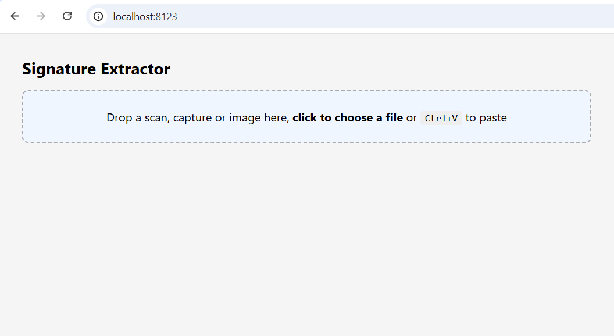
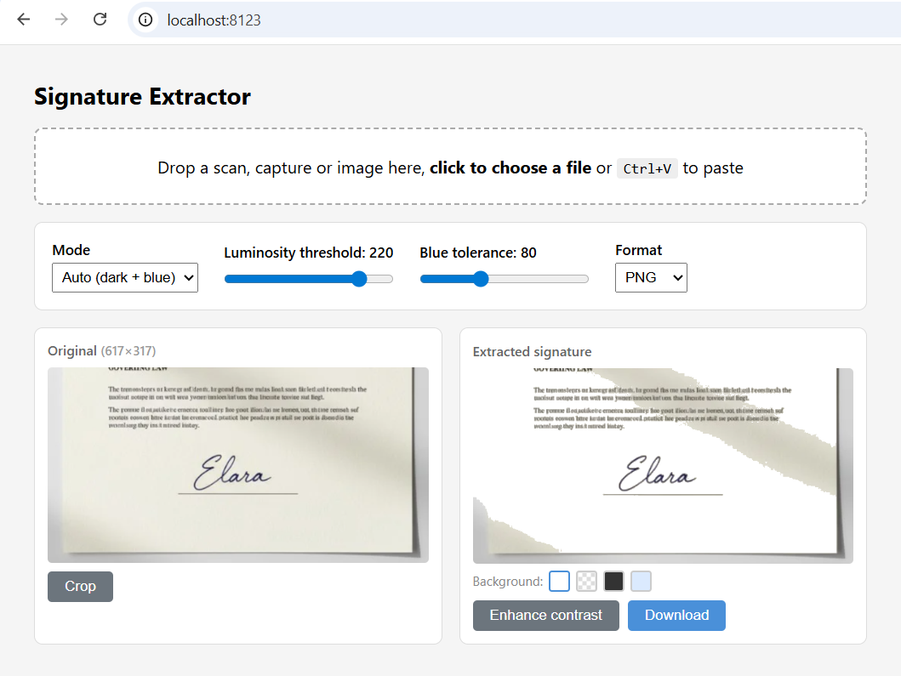
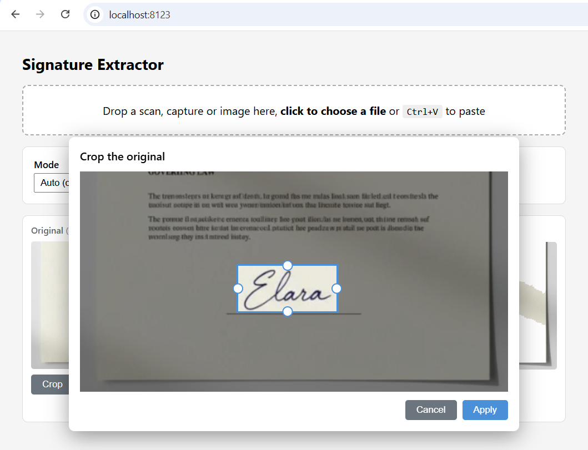
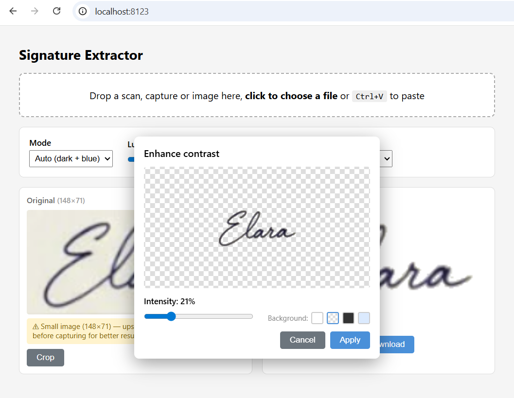

# Signature Remove Background

[](LICENSE)

Micro-service for extracting handwritten signatures (dark/blue ink) from scanned white backgrounds. Returns a transparent PNG or WebP.

**No ML model** — simple colorimetric thresholding with NumPy/Pillow. Ultra-lightweight (~30 MB RAM idle).

## Comparison with ML solutions

| | ML solutions (rembg, withoutbg…) | Signature Remove BG |
|---|---|---|
| RAM idle | ~2 GB | ~30 MB |
| RAM processing | ~2.5 GB | ~50–80 MB |
| Time/image | 2–5 s | < 100 ms |
| Docker image | ~1.5 GB | ~120 MB |
| Use case | Any background | Signatures on light backgrounds |

## Prerequisites

- Docker + Docker Compose

## Installation

```bash
git clone https://github.com/fchaussin/signature-remove-bg.git
cd signature-remove-bg
docker compose up -d
```

The service is available at `http://localhost:8000`.

## Web interface

Open `http://localhost:8000` in a browser.

### Uploading an image



Three import methods:
- **Drag & drop** a scan, capture or image onto the upload zone
- **Click** the zone to open the file picker
- **Ctrl+V** anywhere to paste a screenshot from the clipboard

The upload zone stays visible at the top of the page so you can load a new image at any time.

### Real-time settings



After uploading, a settings panel appears with instant preview:

| Setting | Description |
|---|---|
| Mode | `Auto` (dark + blue), `Dark only`, `Blue only` |
| Luminosity threshold | Sensitivity to dark pixels (50–250) |
| Blue tolerance | Sensitivity to blue tints (20–200) |
| Format | PNG or WebP |

Each change triggers automatic re-extraction (debounced at 300 ms).

### Cropping



The **Crop** button (on the original panel) opens a cropping tool with 4 edge handles (top, bottom, left, right) that can be dragged inward. Excluded areas are dimmed in real time. Applying the crop updates the original image and re-triggers extraction automatically.

### Contrast enhancement


The **Enhance contrast** button opens a tool to darken the signature and boost its opacity, useful for faint scans.

### Actual-size zoom



Click the original or extracted image to open a popup at actual size (1:1). If the image exceeds the viewport, move the mouse to pan.

### Signature preview

The preview area displays the extracted signature. A background color picker lets you visualize the result on different backgrounds:

- **White** (default) — simulates final use on a document
- **Checker** — shows alpha channel transparency
- **Dark** — for verifying light signatures
- **Light blue** — simulates a colored document background

### Download

The **Download** button saves the extracted signature in the chosen format.

### Resolution warnings

The interface shows non-blocking hints:
- **Small image**: yellow banner suggesting to zoom in before capturing
- **Large image**: blue banner noting the preview is scaled down

## Multi-language support

The interface detects the browser language and loads the appropriate translation file. Currently supported:
- English (default fallback)
- French

Translations are stored in `static/lang/*.json`. Adding a new language only requires creating a new JSON file.

## REST API

**Endpoint**: `POST /extract`

**Query parameters**:

| Parameter | Type | Default | Description |
|---|---|---|---|
| `mode` | string | `auto` | `auto` (dark + blue), `dark` (dark only), `blue` (blue only) |
| `threshold` | int | `220` | Luminosity threshold (50–250). Higher = more pixels captured |
| `blue_tolerance` | int | `80` | Blue sensitivity (20–200) |
| `format` | string | `png` | Output format: `png` or `webp` |

**Body**: `multipart/form-data` with a `file` field containing the image.

**Response codes**:

| HTTP | Code | Description |
|---|---|---|
| 200 | `OK` | Success (image blob returned) |
| 400 | `FILE_REQUIRED` | No file provided |
| 400 | `INVALID_FILE` | Unreadable or invalid image |
| 400 | `FILE_TOO_LARGE` | File exceeds size limit |
| 400 | `IMAGE_TOO_LARGE` | Image dimensions exceed limit |
| 500 | `PROCESSING_FAILED` | Unexpected extraction error |

**Examples**:

```bash
# Auto mode (dark + blue), default settings
curl -X POST "http://localhost:8000/extract" \
  -F "file=@scan.jpg" -o signature.png

# Blue signatures only
curl -X POST "http://localhost:8000/extract?mode=blue" \
  -F "file=@scan.jpg" -o signature.png

# Adjusted threshold for grayish scans
curl -X POST "http://localhost:8000/extract?threshold=200" \
  -F "file=@scan.jpg" -o signature.png

# WebP output
curl -X POST "http://localhost:8000/extract?format=webp" \
  -F "file=@scan.jpg" -o signature.webp
```

**Health check**:

```bash
curl http://localhost:8000/health
# {"status":"ok"}
```

## Project structure

```
app.py                 # FastAPI backend + extraction logic
static/
  index.html           # HTML structure
  style.css            # Styles (CSS variables, responsive, a11y)
  app.js               # Frontend logic (OWASP-hardened)
  i18n.js              # Internationalization module
  vendor/
    purify.min.js      # DOMPurify (HTML sanitization)
  lang/
    en.json            # English translations
    fr.json            # French translations
  screenshots/         # README screenshots
Dockerfile
docker-compose.yml
requirements.txt
.env.example           # Environment variables reference
DEPENDENCIES.md        # Why each dependency is used and upgrade notes
.github/
  dependabot.yml       # Automated dependency updates (pip + Docker)
  workflows/
    security-audit.yml # Weekly pip-audit for known CVEs
```

## Configuration

Environment variables (all optional, with sensible defaults). Can be set via a `.env` file (see `.env.example`):

| Variable | Default | Description |
|---|---|---|
| `HOST` | `0.0.0.0` | Server bind address (internal) |
| `PORT` | `8000` | Server port (internal) |
| `PUBLIC_PORT` | `8000` | Port exposed on host machine |
| `MAX_UPLOAD_MB` | `50` | Maximum upload file size in MB |
| `DEFAULT_MODE` | `auto` | Default extraction mode (`auto`, `dark`, `blue`) |
| `DEFAULT_THRESHOLD` | `220` | Default luminosity threshold (50–250) |
| `DEFAULT_BLUE_TOLERANCE` | `80` | Default blue sensitivity (20–200) |
| `DEFAULT_FORMAT` | `png` | Default output format (`png`, `webp`) |
| `CORS_ORIGINS` | `*` | Allowed CORS origins (comma-separated) |
| `MAX_IMAGE_PIXELS` | `50000000` | Pillow decompression bomb limit |
| `MAX_IMAGE_DIMENSION` | `10000` | Maximum width or height in pixels |

## Technical specifications

- **Runtime**: Python 3.12 / FastAPI / Uvicorn
- **Dependencies**: Pillow, NumPy, python-multipart
- **Algorithm**: luminosity thresholding (BT.601 formula) + blue channel dominance detection
- **Input formats**: JPEG, PNG, WebP, BMP, TIFF (anything Pillow supports)
- **Output format**: PNG or WebP with alpha channel (transparent background)
- **Docker limits**: 128 MB RAM, 1 CPU (configurable in `docker-compose.yml`)

## Parameter tuning

- **Clean scan, crisp dark signature**: default settings (`threshold=220`)
- **Grayish scan / recycled paper**: lower threshold (`threshold=140–160`)
- **Very faint signature**: raise threshold (`threshold=200–220`)
- **Background noise captured**: lower threshold (`threshold=120–150`)
- **Light blue pen**: lower `blue_tolerance` (`blue_tolerance=40–60`)

## License

[MIT](LICENSE)
